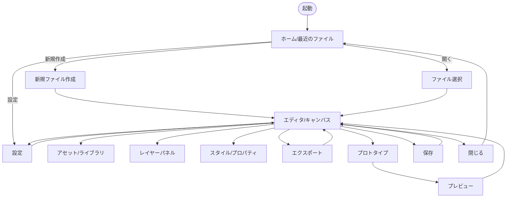
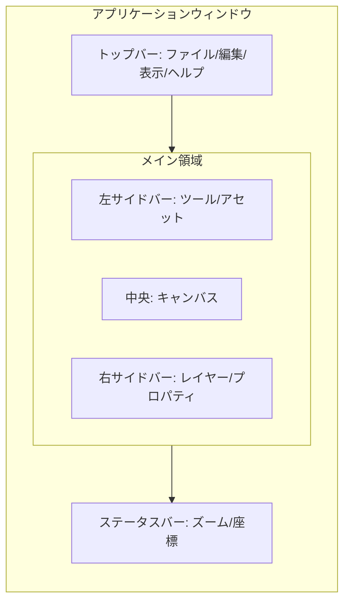

# 画面遷移図（Mermaid）

作成日: 2026年1月31日
対象: Rust + Tauri によるLinux向けワイヤーフレーム作成アプリ

---

## 画面遷移フロー

---

## 画面イメージ（簡易ワイヤーフレーム）

Mermaidでの画面イメージは簡易表現になります。以下はエディタ画面のイメージです。

> 画面イメージを本格的に出力する場合は、UIモックツール（Figma等）で作成し、画像として貼り付ける方法が一般的です。
