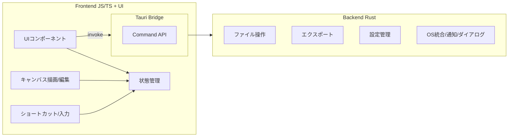
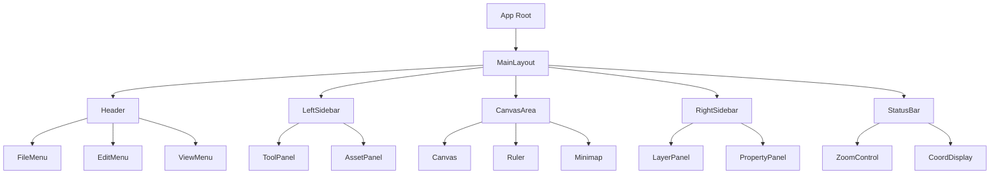
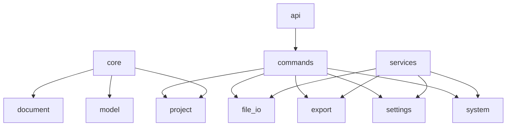

# モジュール・コンポーネント構成図

作成日: 2026年1月31日
対象: Rust + Tauri によるLinux向けワイヤーフレーム作成アプリ
目的: フロントエンド/バックエンドの分割と責務境界を明確化

---

## 1. 全体構成（境界の明確化）

### 役割の境界（要点）
- **JS/TS側**: UI/UX、キャンバス操作、状態管理、軽量なバリデーション
- **Rust側**: ファイルI/O、エクスポート、OS連携、設定の永続化

---

## 2. Frontend コンポーネント分割

---

## 3. Backend モジュール分割（Rust）

### モジュール責務（概要）
- `core/project`: プロジェクト管理（作成/読み込み/保存）
- `core/document`: ページ/レイヤー/ノード構造
- `core/model`: 共有データ構造（DTO/型定義）
- `services/file_io`: ファイル入出力、最近使ったファイル
- `services/export`: PNG/SVG/PDF 生成
- `services/settings`: 設定の永続化
- `services/system`: OS通知、ダイアログ
- `api/commands`: Tauriコマンドの公開窓口

---

## 4. JS/TS と Rust の責務境界

| 領域 | JS/TS（Frontend） | Rust（Backend） |
|---|---|---|
| UI描画 | 画面/コンポーネント | なし |
| キャンバス操作 | 選択/移動/変形/スナップ | なし |
| 状態管理 | 画面状態/一時データ | なし |
| 永続化 | なし | ファイル保存/読み込み |
| エクスポート | UI操作のみ | 画像/PDF生成 |
| OS連携 | なし | ダイアログ/通知 |
| 設定 | UI反映 | 保存/読み込み |

---

## 5. 境界越えの通信（例）

- JS/TS → Rust
  - `save_project(project)`
  - `export_canvas(project_id, page_id, export)`
  - `select_file_dialog(filters)`
- Rust → JS/TS
  - エラー通知（`AppError`）
  - 保存完了（`SaveResult`）
